## Mandelbrot Demo

Parallel Computer Systems assignment focused on comparing a classic single-threaded Mandelbrot computation with a parallel version implemented using `Parallel.For`.

## Navigation

- [Overview](#overview)
- [Visual Gallery](#visual-gallery)
- [Results Summary](#results-summary)
- [Graphs](#graphs)
- [Speedup and Efficiency](#speedup-and-efficiency)
- [AMD uProf Profiling](#amd-uprof-profiling)
- [How It Works](#how-it-works)
- [Code Examples](#code-examples)
- [Running](#running)
- [Inputs](#inputs)
- [Outputs](#outputs)
- [Project Structure](#project-structure)
- [Configuration](#configuration)
- [Project Settings](#project-settings)
- [Test Environment](#test-environment)

## Overview

This project computes and visualizes the Mandelbrot set, measures execution time, writes benchmark reports, and displays the final image in a Windows Forms viewer.

The main comparison in this repository is:

- **Ordinary computation**: one thread processes all rows and all pixels using a standard nested loop.
- **Parallel computation with `Parallel.For`**: rows are distributed across multiple worker threads, while the mathematical formula remains exactly the same.

That means the **output image is identical**, but the total runtime can be much lower when the workload is large enough.

## Visual Gallery

The repository keeps a curated `images/` folder for README previews. Full generated renders are saved into `mandelbrot-images/`, which is ignored in Git.

### Iteration Depth at 800x600

<table>
  <tr>
    <td align="center" width="50%">
      
      <br />
      <sub>500 iterations. At this depth the shape is already recognizable, but the boundary is still relatively rough. Median time: 117 ms sequential, 16 ms with 16 threads.</sub>
    </td>
    <td align="center" width="50%">
      
      <br />
      <sub>5000 iterations. The edge becomes much richer and more stable, but the work grows significantly. Median time: 1157 ms sequential, 140 ms with 16 threads.</sub>
    </td>
  </tr>
</table>

## Results Summary

The benchmark results show two clear effects:

1. Increasing `maxIterations` improves visual detail, but also increases runtime.
2. Replacing the ordinary nested loop with `Parallel.For` preserves the same image while reducing wall-clock time.

Representative median benchmark values:

| Resolution | Iterations | Sequential | Parallel 16 threads | Speedup | Efficiency |
| --- | ---: | ---: | ---: | ---: | ---: |
| 800x600 | 500 | 117 ms | 16 ms | 7.31x | 45.70% |
| 800x600 | 5000 | 1157 ms | 140 ms | 8.26x | 51.62% |
| 1920x1080 | 1000 | 1362 ms | 135 ms | 10.09x | 63.06% |
| 1920x1080 | 5000 | 6714 ms | 696 ms | 9.65x | 60.29% |

Interpretation:

- Small workloads benefit from parallelization, but thread scheduling overhead is still visible.
- Heavier workloads scale better because each worker gets enough useful work to amortize the parallel overhead.
- The implementation does not reach ideal linear scaling, which is expected because of memory traffic, scheduling overhead, and the fact that not every pixel has the same amount of work.

## Graphs

The following plots summarize measured runtimes across resolutions and iteration counts. They were prepared from the benchmark data and show the difference between the ordinary implementation and the `Parallel.For` implementation with different thread counts.

<table>
  <tr>
    <td align="center" width="50%">
      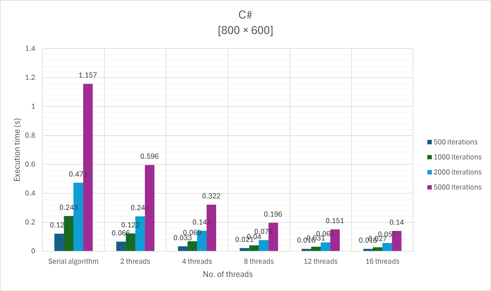
      <br />
      <sub>800x600 benchmark comparison across iteration counts and thread counts.</sub>
    </td>
    <td align="center" width="50%">
      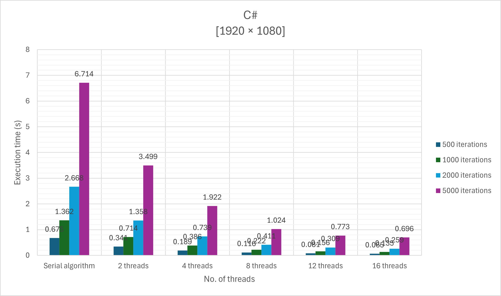
      <br />
      <sub>1920x1080 benchmark comparison across iteration counts and thread counts.</sub>
    </td>
  </tr>
  <tr>
    <td align="center" width="50%">
      
      <br />
      <sub>2560x1440 benchmark comparison across iteration counts and thread counts.</sub>
    </td>
    <td align="center" width="50%">
      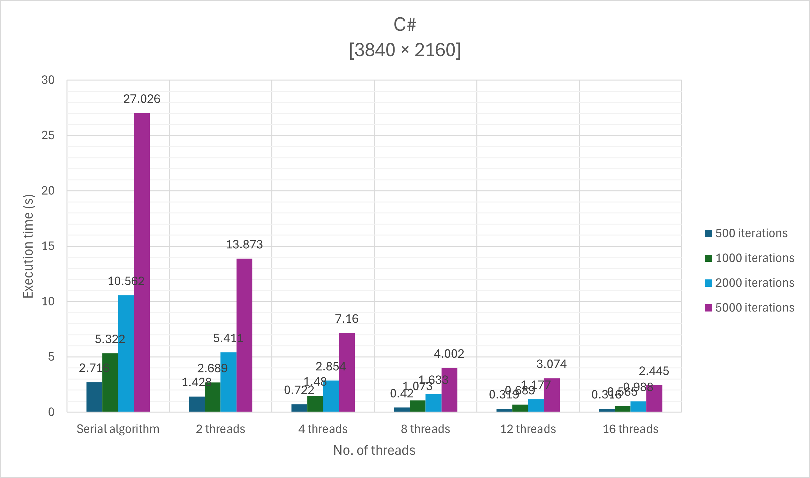
      <br />
      <sub>3840x2160 benchmark comparison across iteration counts and thread counts.</sub>
    </td>
  </tr>
</table>

## Speedup and Efficiency

To evaluate scalability, the project uses these standard metrics:

- `Speedup(p) = T_sequential / T_parallel(p)`
- `Efficiency(p) = Speedup(p) / p`

Where:

- `T_sequential` is the median time of the ordinary single-threaded implementation
- `T_parallel(p)` is the median time of the `Parallel.For` version using `p` threads

Example calculation for `1920x1080`, `1000` iterations, `16` threads:

- `T_sequential = 1362 ms`
- `T_parallel(16) = 135 ms`
- `Speedup(16) = 1362 / 135 = 10.09x`
- `Efficiency(16) = 10.09 / 16 = 0.6306 = 63.06%`

This means the parallel version finishes the same work about ten times faster, while each thread contributes about 63% of the ideal linear gain.

The plots below visualize how speedup and efficiency behave across resolutions and workloads:

<table>
  <tr>
    <td align="center" width="50%">
      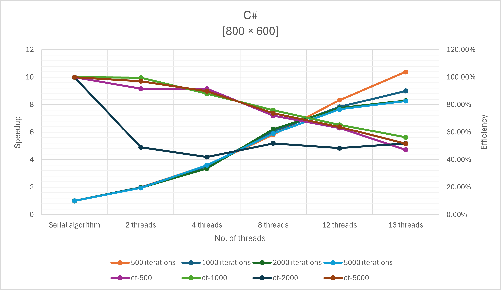
      <br />
      <sub>Speedup and efficiency for 800x600.</sub>
    </td>
    <td align="center" width="50%">
      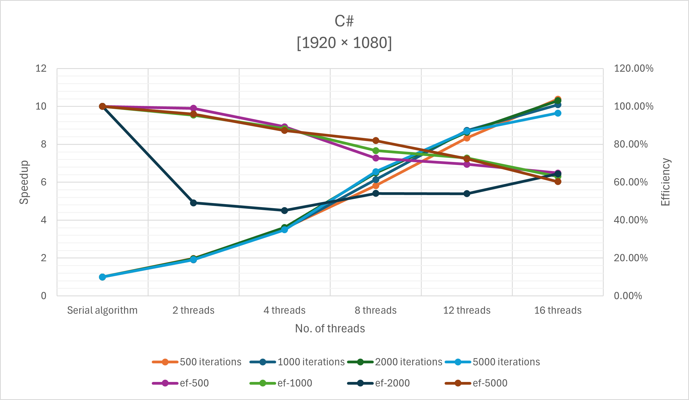
      <br />
      <sub>Speedup and efficiency for 1920x1080.</sub>
    </td>
  </tr>
  <tr>
    <td align="center" width="50%">
      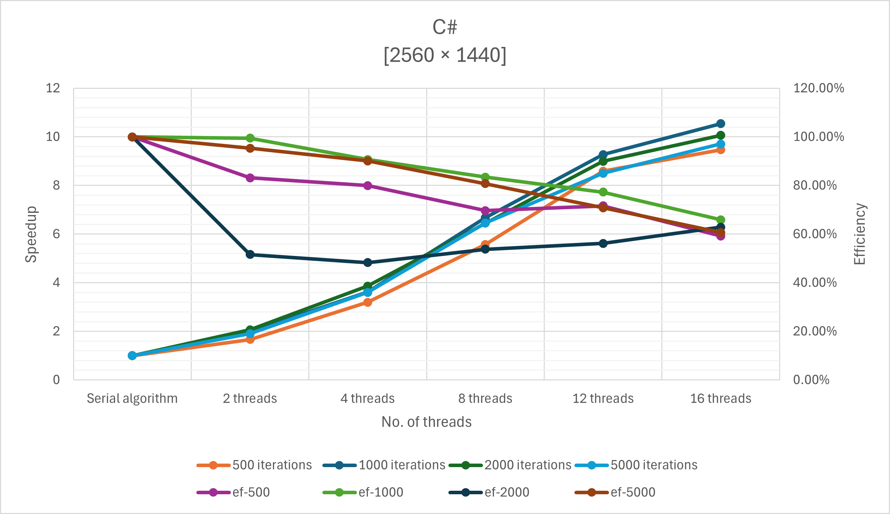
      <br />
      <sub>Speedup and efficiency for 2560x1440.</sub>
    </td>
    <td align="center" width="50%">
      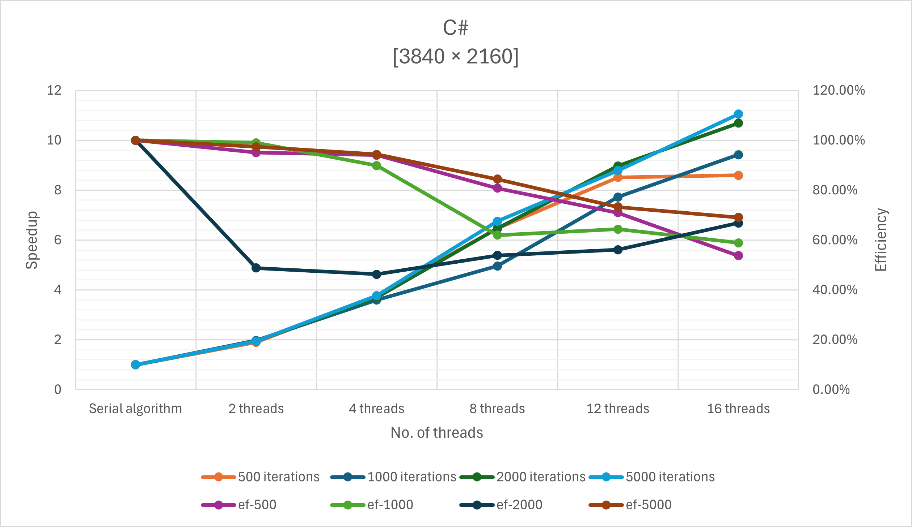
      <br />
      <sub>Speedup and efficiency for 3840x2160.</sub>
    </td>
  </tr>
</table>

## AMD uProf Profiling

AMD uProf screenshots were used to confirm the behavioral difference between the ordinary implementation and the `Parallel.For` version.

What to look for:

- In the ordinary version, one worker is busy for most of the measured interval.
- In the parallel version, work is spread across multiple threads.
- With large resolutions and large iteration counts, the parallel version keeps more CPU resources busy and shortens total execution time.

<table>
  <tr>
    <td align="center" width="50%">
      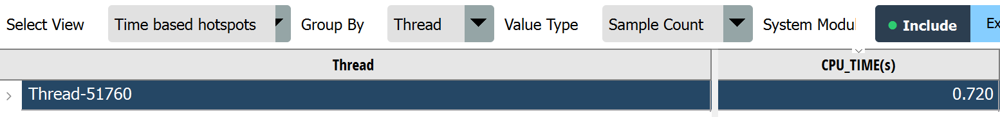
      <br />
      <sub>Sequential, 800x600, 500 iterations. The workload is short and concentrated in a single execution path.</sub>
    </td>
    <td align="center" width="50%">
      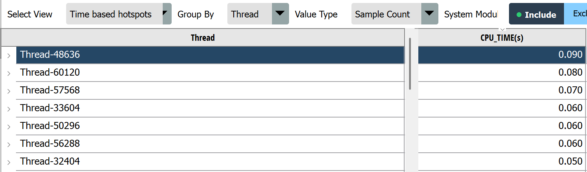
      <br />
      <sub>Parallel, 800x600, 500 iterations, 16 threads. Work is distributed across multiple workers and completes much faster.</sub>
    </td>
  </tr>
  <tr>
    <td align="center" width="50%">
      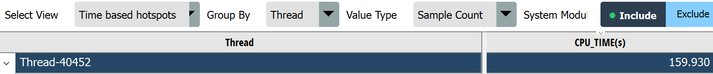
      <br />
      <sub>Sequential, 4K, 5000 iterations. Heavy workload, long critical path, one-thread bottleneck.</sub>
    </td>
    <td align="center" width="50%">
      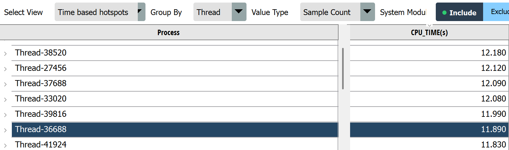
      <br />
      <sub>Parallel, 4K, 5000 iterations, 16 threads. The same algorithm runs with much higher hardware utilization.</sub>
    </td>
  </tr>
</table>

## How It Works

For each pixel `(px, py)`, the program maps screen coordinates to a complex-plane point `c = x0 + y0*i` and iterates:

`z(n+1) = z(n)^2 + c`, with `z(0) = 0`

The iteration stops when:

- `|z| > 2`, meaning the point escaped, or
- `maxIterations` is reached, meaning the point is treated as belonging to the set

The resulting iteration count is stored in a flat integer array and later converted into colors.

High-level pipeline:

1. Compute escape counts for all pixels.
2. Convert counts to colors.
3. Render the bitmap.
4. Measure runtime over multiple runs.
5. Report the median to reduce noise from outliers.

## Code Examples

### Ordinary Single-Threaded Computation

```csharp
// One thread walks over every row and every pixel.
for (int py = 0; py < height; py++)
{
    double y0 = startY + py * step; // Imaginary part for the current row
    int rowOffset = py * width;     // Start index of this row in the flat output array

    for (int px = 0; px < width; px++)
    {
        double x0 = startX + px * step; // Real part for the current pixel

        double x = 0.0;
        double y = 0.0;
        double xx = 0.0; // Cached x^2
        double yy = 0.0; // Cached y^2
        int iteration = 0;

        // Standard Mandelbrot recurrence:
        // z = z^2 + c, repeated until the point escapes or we hit maxIterations.
        while (xx + yy <= 4.0 && iteration < maxIterations)
        {
            y = 2.0 * x * y + y0; // Imaginary part of z^2 + c
            x = xx - yy + x0;     // Real part of z^2 + c

            xx = x * x;
            yy = y * y;
            iteration++;
        }

        data[rowOffset + px] = iteration; // Save escape count for this pixel
    }
}
```

### Parallel Computation Using `Parallel.For`

```csharp
var options = new ParallelOptions
{
    MaxDegreeOfParallelism = MandelbrotConfig.Threads
};

// Each iteration handles one row.
// Rows do not overlap in the output array, so no lock is needed.
Parallel.For(0, height, options, py =>
{
    double y0 = startY + py * step; // Imaginary part for this row
    int rowOffset = py * width;     // Unique output range owned by this worker

    for (int px = 0; px < width; px++)
    {
        double x0 = startX + px * step; // Real part for the current pixel

        double x = 0.0;
        double y = 0.0;
        double xx = 0.0;
        double yy = 0.0;
        int iteration = 0;

        // Same mathematics as the sequential version.
        // Only the distribution of rows across threads changes.
        while (xx + yy <= 4.0 && iteration < maxIterations)
        {
            y = 2.0 * x * y + y0;
            x = xx - yy + x0;

            xx = x * x;
            yy = y * y;
            iteration++;
        }

        data[rowOffset + px] = iteration; // Safe write: this row belongs only to this worker
    }
});
```

### Fast Bitmap Rendering

The project also distinguishes between a simple rendering path and a faster one:

- `SetPixel`: easy to understand, but slow for large images because it touches the bitmap pixel-by-pixel
- `LockBits`: writes raw pixel data into memory, which is much faster for large outputs

This is important because image creation can otherwise distort benchmark interpretation.

## Running

### PowerShell (`start.ps1`)

```powershell
.\start.ps1                          # sequential benchmark
.\start.ps1 -par 4                   # parallel benchmark, 4 threads
.\start.ps1 -Mode image              # sequential image viewer
.\start.ps1 -Mode image -par 4       # parallel image viewer
.\start.ps1 -Mode all                # benchmark + image, sequential
.\start.ps1 -Mode all -par 4         # benchmark + image, parallel
.\start.ps1 -cmd                     # print benchmark output to console
.\start.ps1 -par 4 -cmd              # parallel benchmark output to console
```

### Bash (`start.sh`)

```bash
./start.sh                           # sequential benchmark
./start.sh -par 4                    # parallel benchmark, 4 threads
./start.sh image                     # sequential image viewer
./start.sh image -par 4              # parallel image viewer
./start.sh all                       # benchmark + image, sequential
./start.sh all -par 4                # benchmark + image, parallel
```

Supported thread counts used in the project are `2`, `4`, `8`, `12`, and `16`.

## Inputs

- CLI modes:
  - `--benchmark`
  - `--benchmark-par <threads>`
  - `--image`
  - `--image-par <threads>`
  - `--cmd`
- Configuration in `MandelbrotConfig.cs`:
  - resolution
  - max iterations
  - viewport center and scale
  - warmup count
  - measured run count
  - thread count

## Outputs

### Benchmark Reports

- Sequential: `results/sequential/<report-file>.txt`
- Parallel: `results/parallel/<WxH>/<report-file>.txt`
- Filename pattern:
  - `results-{sequential|parallel-<threads>threads}-{WarmupRuns}warmup-{Runs}runs-<WxH>.txt`

### Rendered Images

- The Windows Forms viewer shows total compute time in the window title.
- Press `Ctrl+S` to save a PNG.
- Output folders:
  - Sequential: `mandelbrot-images/sequential/<WxH>/`
  - Parallel: `mandelbrot-images/parallel/<WxH>/threads-<n>/`

## Project Structure

- `Program.cs` - entry point and mode dispatch
- `MandelbrotUtils.cs` - Mandelbrot computation, rendering, benchmarking, reporting
- `MandelbrotConfig.cs` - active resolution, iteration count, viewport, thread count
- `MandelbrotForm.cs` - Windows Forms image viewer
- `start.ps1` - PowerShell runner
- `start.sh` - Bash runner
- `images/` - curated README images and graphs
- `results/` - generated benchmark reports
- `mandelbrot-images/` - generated output images
- `amduprof-images/` - generated profiling screenshots

## Configuration

The most important knobs live in `MandelbrotConfig.cs`:

- resolution presets: `800x600`, `1920x1080`, `2560x1440`, `3840x2160`
- iteration presets: `500`, `1000`, `2000`, `5000`
- viewport: `CenterX`, `CenterY`, `Scale`
- benchmarking: `WarmupRuns`, `Runs`
- parallel settings: `Parallel`, `Threads`

## Project Settings

- SDK: `Microsoft.NET.Sdk`
- Output type: `Exe`
- Target framework: `net10.0-windows`
- Windows Forms enabled: `true`
- Root namespace: `_3_volitelna`
- `ImplicitUsings`: `enable`
- `Nullable`: `enable`
- `PlatformTarget`: `x64`

Release configuration:

- `Optimize=true`
- `TieredCompilation=true`
- `TieredPGO=true`
- `TieredCompilationQuickJit=false`
- `TieredCompilationQuickJitForLoops=false`
- `ServerGarbageCollection=true`

## Test Environment

Benchmarks and profiling were produced on:

- CPU: AMD Ryzen 7 8840HS, 8 cores / 16 threads, Radeon 780M
- RAM: 16 GB DDR5
- OS: Windows 11 Home
- .NET SDK: 10.0.103
- Profiler: AMD uProf 5.2.431.0
